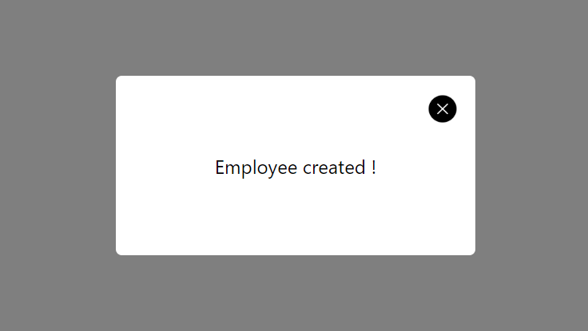

# React-simple-modal-package

This modal take all view screen with backdrop dark effect.

## Screenshots



## Installation

```bash
  npm install react-simple-modal-package
```

or

```bash
  yarn add react-simple-modal-package
```

## Usage/Examples

🚨 It is important to put the component at a higher level of you page so the modal takes up all the space.

```javascript
import React, { useState } from "react";
import Modal from "react-simple-modal-package";

const MyPage = ({ children }) => {
  const [showModal, setShowModal] = useState(false);

  return (
    <div className="container">
      <Modal visible={showModal} setVisible={setShowModal}>
        <p>Here i put whatever i want to display in my modal</p>
      </Modal>
      <p>All my page content</p>
    </div>
  );
};

export default MyPage;
```

## Pops

- ⚠️(required) visible: (bolean)
- ⚠️(required) setVisible: for close button (return false)
- children: <Modal>Your children here !</Modal>
- backdropOpacity: makes the background darker (default 0.5)
- modalStyle: change modal style (object)
- disableCloseButton: (bolean)
